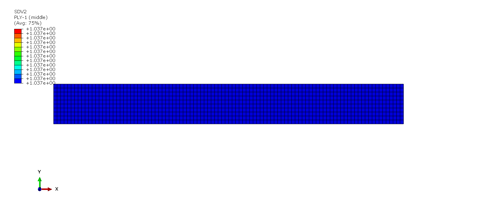
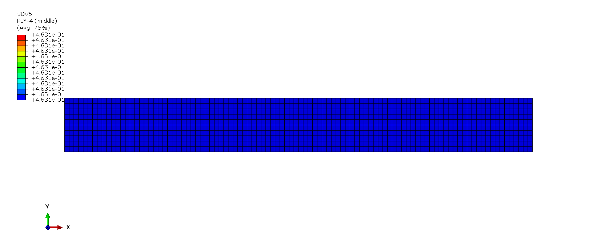

# Puck-2D-Subroutine

<em>Different Modes of Inter Fiber Failure Modes</em>

The following is a UMAT subroutine for Puck failure criteria in Abaqus. It applies only to unidirectional composites. The general form of the Puck criterion utilizes the entire 3-D state of stress and strain, but this subroutine is used for only 2D elements. The equations for the different failure modes are given below.

### Fiber Failure in Tension
The fiber failure in tension is given by 
$$F_f = \frac{\sigma_1}{R^t_\parallel}$$

### Fiber Failure in Compression
The fiber failure in tension is given by 
$$F_f = -\frac{\sigma_1}{R^c_\parallel}$$

### Inter Fiber Failure : Mode A
This mode is valid when $\sigma_2 > 0$
$$F_m = \sqrt{\Bigl(   \frac{\tau_{21}  }{ R_{\perp\parallel} } \Bigl)^2 +  \Bigl( 1 - p^t_{\perp \parallel} \frac{R^t_\perp}{R_{\perp\parallel}}\Bigl)^2  \Bigl( \frac{\sigma_2}{R^t_\perp} \Bigl)^2 } + p^t_{\perp \parallel} \frac{\sigma_2}{R_{\perp\parallel}}$$

### Inter Fiber Failure : Mode B
This mode is valid when $\sigma_2 < 0$ and $0\leq  \big| \frac{\sigma_2}{\tau_{21}} \big| \leq \frac{R^A_{\perp\perp}}{|\tau_{21c}|}$
$$F_m = \frac{1}{R_{\perp \parallel}} \Bigl[ \sqrt{ \tau_{21}^2 + ( p_{\perp \parallel}^c \sigma_2 )^2 } +  p_{\perp \parallel}^c \sigma_2 \Bigr]$$

### Inter Fiber Failure : Mode C
This mode is valid when $\sigma_2 < 0$ and $0\leq  \big| \frac{\tau_{21}}{\sigma_2} \big| \leq \frac{|\tau_{21c}|}{R^A_{\perp\perp}}$
$$F_m = \Big( \frac{R^c_\perp}{ -\sigma_2} \Big) \Bigl[  \Bigl(\frac{\tau_{21}}{2(1+P^c_{\perp\perp})R_{\perp\parallel}}  \Bigr)^2 + \Bigl(\frac{\sigma_2}{R^c_\perp}\Bigr)^2  \Bigr] $$

# Input to the Model

The following properties need to be entered in the following order.
  * Youngs Modulus in 1 Direction $E_{\parallel}$
  * Youngs Modulus in 2 Direction $E_{\perp}$
  * Poisson's Ratio in 1-2 Plane $\nu_{\perp\parallel}$
  * Inplane Shear Modulus $G_{\perp\parallel}$
  * Longitudinal Strength in 1 Direction $R^t_\parallel$
  * Compressive Strength in 1 Direction $R^c_\parallel$
  * Longitudinal Strength in 2 Direction $R^t_\perp$
  * Compressive Strength in 2 Direction $R^c_\perp$
  * Inplane Shear Strength $R_{\perp\parallel}$
  * Flag for Indicating the Type of Material
     * 1 for CFRP
     * 2 for GFRP
 
 # Output Visualization
 
There are five solution-dependent state variables. They are as follows
  * SDV1 : Fiber Failure in Tension
  * SDV2 : Fiber Failure in Compression
  * SDV3 : Inter Fiber Failure : Mode A
  * SDV4 : Inter Fiber Failure : Mode B
  * SDV5 : Inter Fiber Failure : Mode C

# Verification

|  | 
|:--:| 
| *FE Model and Boundary Conditions* |

A simple tensile test is performed to check the working of the UMAT. The specimen dimensions are 100mm x 10mm. The ply layup is $[0/+45/-45/90]_s$, and each ply is 0.125mm thick. The left end of the specimen is fixed in X, Z, ROTX, ROTY, and ROTZ, and the middle of the left end is fixed in Y. A displacement of 0.15mm is applied on the right end. The material properties are
* $E_{\parallel}$ = 135e3 MPa
* $E_{\perp}$ = 10e3 MPa
* $\nu_{\perp\parallel}$ = 0.25
* $G_{\perp\parallel}$ = 4.3e3 MPa
* $R^t_\parallel$ = 2410 MPa
* $R^c_\parallel$ = 1300 MPa
* $R^t_\perp$ = 86 MPa
* $R^c_\perp$ = 200 MPa
* $R_{\perp\parallel}$ = 152 MPa  
* Type of Material is CFRP

|  | 
|:--:| 
| *eLamX Results* |

The same model has been created in eLamX; a composite calculator developed at TU Dresden. Above are the results of the eLamX calculator. From the above image, It can be seen that the failure occurs in the 90° ply. Now we shall be comparing these with the Abaqus UMAT results.

|  | 
|:--:| 
| *Ply 1* |

For the 1st ply, the dominant failure mode is the fiber tension(SDV 1). The failure index is 0.8393. The inverse of the failure index is called the Reserve Factor(RF). The reserve factor for ply 1 is 1.193

|  | 
|:--:| 
| *Ply 2* |

|  | 
|:--:| 
| *Ply 3* |

For the 2nd and 3rd ply, the dominant mode is an inter-fiber failure: mode A (SDV 3). The failure index is 0.9705. The reserve factor for ply 2 and 3 is 1.03

|  | 
|:--:| 
| *Ply 4* |

For the 4th ply, the dominant mode is an inter-fiber failure: mode A (SDV 3). The failure index is 1.615, which means the failure has started as its value is more than 1. The reserve factor is 0.619

The results of the UMAT do match eLamX results and predict the dominant mode of failure correctly.
